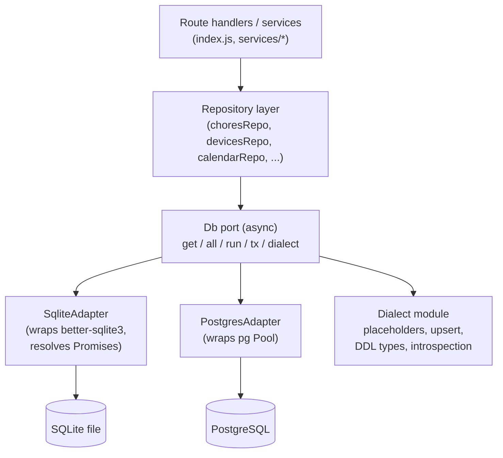

# Design Plan: Data Persistence Abstraction & PostgreSQL Support

Status: **Proposal / planning** — no production code changed by this document.
Scope: introduce a persistence abstraction so HomeGlow can run on SQLite (today) or
PostgreSQL (new), with room for other DBMSs later.

## Table of Contents
- [1. Current State](#1-current-state)
- [2. The Core Challenge: Synchronous → Asynchronous](#2-the-core-challenge-synchronous--asynchronous)
- [3. Target Architecture](#3-target-architecture)
- [4. SQL Dialect Differences](#4-sql-dialect-differences)
- [5. Sequences / Auto-Increment](#5-sequences--auto-increment)
- [6. Foreign Keys & Indexes](#6-foreign-keys--indexes)
- [7. Migration System Strategy](#7-migration-system-strategy)
- [8. Phased Implementation Plan (Test-First)](#8-phased-implementation-plan-test-first)
- [9. Configuration & Operations](#9-configuration--operations)
- [10. Risks & Open Decisions](#10-risks--open-decisions)

---

## 1. Current State

**No ORM is in use.** `server/package.json` depends only on `better-sqlite3` for
persistence — no Sequelize/Prisma/TypeORM/Knex/Drizzle/Kysely. All data access is
hand-written SQL.

Coupling surface (measured):
- **~157 `db.prepare()`** sites in `server/index.js`, **~29** in `services/`, plus
  raw DDL in all 15 `migrations/` modules. ~250+ query sites total
  (`.get()` ×121, `.all()` ×32, `.run()` ×66).
- `db` is a **module-global** in `index.js` created by `ConnectOrCreateDb()`
  (`new Database(dbPath)`), then **injected into services** via constructor
  (`new CalendarSyncService(db, …)`) or function args
  (`googleConnection.getConnectedAccount(db)`). This injection is the existing seam
  we build the abstraction on.
- **better-sqlite3-specific API:** `new Database()`, `.pragma('foreign_keys=ON')`,
  `.transaction()` (×3: tab reorder, tab renumber, device copy-from),
  `stmt.lastInsertRowid` (×11), `verbose`.
- **SQLite SQL dialect:** `AUTOINCREMENT` (×19), `INSERT OR IGNORE/REPLACE` (×29),
  `PRAGMA` (×11), `CURRENT_TIMESTAMP` (×24), `sqlite_master`/`PRAGMA table_info`
  introspection, INTEGER-as-boolean (`enabled = 1`), JSON-as-TEXT columns
  (`config_json`, `device_settings_json`).

## 2. The Core Challenge: Synchronous → Asynchronous

This dominates the effort. **better-sqlite3 is synchronous** — `stmt.get()` returns
a row immediately. **node-postgres (`pg`) is asynchronous** — every query returns a
Promise. There is no production-grade synchronous Postgres driver (`deasync` is a
hack and must not be used).

Therefore, supporting Postgres requires the **entire data layer to become
async/await**. Mitigating factor: Fastify route handlers are already `async`, so
adding `await` to DB calls is mechanical rather than structural — but it touches all
~250 sites. This is the largest cost and the main risk, and the phased plan
sequences it so it is verified against SQLite *before* Postgres exists.

## 3. Target Architecture

A small async **persistence port** with swappable adapters, optionally fronted by a
thin repository layer.



Port interface (informal):

```text
db.get(sql, params)          -> Promise<row | undefined>
db.all(sql, params)          -> Promise<row[]>
db.run(sql, params)          -> Promise<{ rowCount, insertId? }>
db.tx(async (txDb) => {...}) -> Promise<result>   // transaction scope
db.dialect                   -> 'sqlite' | 'postgres'
```

- `SqliteAdapter` wraps better-sqlite3 and returns already-resolved Promises — zero
  behavior change for existing SQLite users.
- `PostgresAdapter` wraps a `pg.Pool`; `tx()` checks out a client and runs
  `BEGIN/COMMIT/ROLLBACK`.

**Decision — raw SQL vs query builder:**

| Approach | Solves | Cost |
| --- | --- | --- |
| **A. Thin port + dialect helper** (keep raw SQL) | connection, async, transactions, `?`→`$n`, upsert/`RETURNING`/auto-inc helpers | lowest new dependency; SQL still hand-maintained and audited per dialect |
| **B. Query builder (Kysely/Knex) behind the port** | all of A **plus** dialect-correct SQL generation, parameter binding, and a migration runner for both engines | larger rewrite of query sites; removes whole classes of dialect bugs and replaces the bespoke migration system |

Recommendation: **start with A** to decouple without changing query semantics, then
**evaluate B** once the port exists. The port interface is identical either way, so
A→B is non-breaking.

## 4. SQL Dialect Differences

| Concern | SQLite (today) | PostgreSQL | Handling |
| --- | --- | --- | --- |
| Auto-inc PK | `INTEGER PRIMARY KEY AUTOINCREMENT` | `GENERATED ALWAYS AS IDENTITY` / `BIGSERIAL` | dialect DDL type |
| Insert + new id | `info.lastInsertRowid` (×11) | `INSERT … RETURNING id` | `run()` returns `insertId`; Pg adapter appends `RETURNING` |
| Upsert | `INSERT OR IGNORE/REPLACE` (×29) | `INSERT … ON CONFLICT (...) DO NOTHING/UPDATE` | dialect upsert helper (per-table conflict target) |
| Placeholders | `?` | `$1,$2,…` | adapter rewrites `?`→`$n` (or builder) |
| Booleans | INTEGER `0/1` (`enabled = 1`) | native `boolean` | keep `smallint 0/1` for parity, or migrate to bool + update predicates |
| Timestamps | `TEXT DEFAULT CURRENT_TIMESTAMP` (ISO strings) | `timestamptz` | keep TEXT for parity initially |
| JSON columns | TEXT (`config_json`, `device_settings_json`) | `text` or `jsonb` | keep `text` initially (app serializes); `jsonb` later |
| FK enforcement | `PRAGMA foreign_keys=ON` | always enforced | drop PRAGMA on Pg |
| Introspection | `sqlite_master`, `PRAGMA table_info` | `information_schema` / `to_regclass` | dialect introspection helpers |
| Transactions | `db.transaction(fn)` sync (×3) | pooled client `BEGIN/COMMIT` | `db.tx()` port method |
| Concurrency | single-writer file | connection pool | review the 3 transactions + read-modify-write paths for races |

## 5. Sequences / Auto-Increment

SQLite hides sequences: `AUTOINCREMENT` is backed by the internal `sqlite_sequence`
table. PostgreSQL makes them explicit (an `IDENTITY`/`SERIAL` column owns a sequence
object). Two consequences:

1. **Data-migration hazard:** copying existing rows into Postgres *with explicit
   `id` values* does **not** advance the identity sequence; the next `INSERT` then
   collides at `id = 1`. Every identity sequence must be reset post-copy:
   ```sql
   SELECT setval(pg_get_serial_sequence('<table>','id'),
                 (SELECT COALESCE(MAX(id), 0) FROM <table>));
   ```
2. **Test coverage:** characterization tests must assert **sequence continuity**
   (insert after seeded/high ids yields `MAX+1`, ids are never reused). This single
   assertion is the engine-agnostic oracle that catches a missed `setval()` on
   Postgres.

## 6. Foreign Keys & Indexes

PostgreSQL does **not** auto-create indexes on FK columns (neither does SQLite). FK
index audit of the **live** schema:

| Table.column (FK) | References | On delete | Indexed? |
| --- | --- | --- | --- |
| `chore_schedules.chore_id` | `chores(id)` | CASCADE | ✅ `idx_chore_schedules_chore_id` |
| **`chore_history.chore_schedule_id`** | `chore_schedules(id)` | **SET NULL** | ❌ **missing** |
| `tabs.device_name` | `devices(name)` | CASCADE | ✅ `idx_tabs_device_name` |
| `calendar_events_cache.source_id` | `calendar_sources(id)` | CASCADE | ✅ `idx_cache_source_id` |
| `calendar_sync_status.source_id` | `calendar_sources(id)` | (is PK) | ✅ implicit (PK) |
| `google_picked_media.source_id` | `photo_sources(id)` | CASCADE | ✅ `idx_google_picked_media_source` |
| `homeglow_photos.source_id` | `photo_sources(id)` | CASCADE | ✅ `idx_homeglow_photos_source` |

**Gap: `chore_history.chore_schedule_id`** — worst one to miss because `ON DELETE
SET NULL` forces a scan of `chore_history` on every schedule delete.

Notes:
- `chore_schedules.user_id`, `chore_history.user_id`, and
  `chore_schedules.parent_schedule_id` are **indexed but not declared FKs** (no
  constraint to `users`/self). Decide whether to promote them to real FKs on
  Postgres (watch the seeded `user_id = 0` `bonus` user and any soft references).

Actions:
- Add `idx_chore_history_chore_schedule_id` via a new SQLite migration (schema 15)
  so SQLite and the future Postgres baseline match (benefits SQLite today).
- Make **"index every FK column"** an explicit rule of the Postgres baseline schema
  and a checklist item for all future migrations.

## 7. Migration System Strategy

The current system (legacy function migrations + `schemaMigrations` 6→14, global
`__HOMEGLOW_SCHEMA_MIGRATION_CONTEXT`, raw SQLite DDL) is SQLite-specific.

**Key decision — do not replay 6→14 on Postgres.** Ship a single **baseline schema
(= current v14)** as Postgres DDL, stamp the version to 14, and require all *new*
migrations to be dialect-aware (via the port/builder). Existing SQLite installs keep
their incremental chain untouched. This avoids porting eight historical migrations
and their data backfills.

## 8. Phased Implementation Plan (Test-First)

Every phase has a binary pass condition: **the Phase 1 suite produces identical
output.**

**1. Characterization / parity test suite against today's SQLite — the golden master.**
   The foundation everything is verified against; reruns unchanged after each phase
   and against each engine.
   - **API-boundary coverage (engine-agnostic, the bulk):** drive every
     data-touching endpoint through the server harness; snapshot responses
     (normalizing volatile ids/timestamps). Covers chores, chore-schedules,
     chore-history (+clam math), users, prizes, devices, tabs, widget-assignments,
     calendar-sources, calendar-events, photo-sources, settings, admin-pin.
   - **SQL-semantics coverage (dialect-risky behaviors):**
     sequence continuity; upsert (`INSERT OR IGNORE/REPLACE` ↔ `ON CONFLICT`);
     insert-then-new-id (`lastInsertRowid` ↔ `RETURNING`); transaction commit **and
     rollback** (the 3 transaction blocks); `ON DELETE CASCADE`/`SET NULL`; JSON
     round-trip; boolean/`enabled` filtering and ordering.
   - Capture `c8` coverage to find unguarded SQL paths before proceeding.

**2. Introduce the port + SQLite adapter, no behavior change.** Rerun Phase 1 — must
   be identical.

**3. Make all call sites async.** `await` every DB call; convert the 3
   `db.transaction()` blocks to `await db.tx(...)`. Rerun Phase 1 against SQLite —
   identical output is the pass condition. (Done while SQLite is the only engine, so
   regressions can't be blamed on Postgres.)

**4. Extract the repository layer + dialect helper.** Incremental, domain by domain;
   rerun Phase 1 after each domain.

**5. Add `PostgresAdapter` (`pg`) + baseline Postgres schema (= v14, FK-indexed).**
   Wire `DB_ENGINE`/`DATABASE_URL`. Run the identical Phase 1 suite against Postgres
   — same golden output proves parity; divergence is a localized dialect bug.

**6. CI matrix.** Run the Phase 1 suite against both engines on every push (Postgres
   via a service container). The characterization suite *is* the parity suite.

**7. Ops + docs + data migration.** Optional `postgres` service in compose,
   `DB_ENGINE`/`DATABASE_URL` docs, one-time SQLite→Postgres copy script with
   post-copy `setval()`; validate by re-running the Phase 1 suite against the
   migrated Postgres DB.

Caveat: a pure API-boundary golden master cannot observe purely internal SQL effects
that never surface in a response (e.g., a cache row deleted but never read back) —
hence Phase 1 pairs API snapshots with explicit SQL-semantics tests (cascade,
rollback, upsert, sequences).

## 9. Configuration & Operations

- New env: `DB_ENGINE` (`sqlite` default — preserves current behavior) and
  `DATABASE_URL` (Postgres). Keep `DB_PATH` for SQLite.
- `docker-compose.yml`: optional `postgres:16` service + volume; backend depends on
  it only when `DB_ENGINE=postgres`.
- `pg.Pool` sizing kept small for Raspberry-Pi-class hosts.

## 10. Risks & Open Decisions

- **Biggest risk:** the async conversion (Phase 3) is broad; a missed un-`await`ed
  call returns a Promise instead of a row and fails subtly. Mitigated by doing it
  while SQLite tests still pass; consider an ESLint `no-floating-promises`-style guard.
- **Decision 1:** Approach A (thin port, raw SQL) vs B (Kysely/Knex). Affects effort
  and whether the bespoke migration runner survives.
- **Decision 2:** Boolean/timestamp/JSON storage — keep SQLite-compatible types on
  Postgres (parity) vs modernize to `boolean`/`timestamptz`/`jsonb`.
- **Decision 3:** Baseline-schema for Postgres (recommended) vs full migration replay.
- **Decision 4:** Promote soft references (`user_id`, `parent_schedule_id`) to real
  FKs on Postgres, or leave as logical references.
- **Security note:** the README's "no security" stance changes with Postgres — a
  network DB introduces credentials and a real attack surface (connection-string
  secrets, network exposure). Document accordingly.
